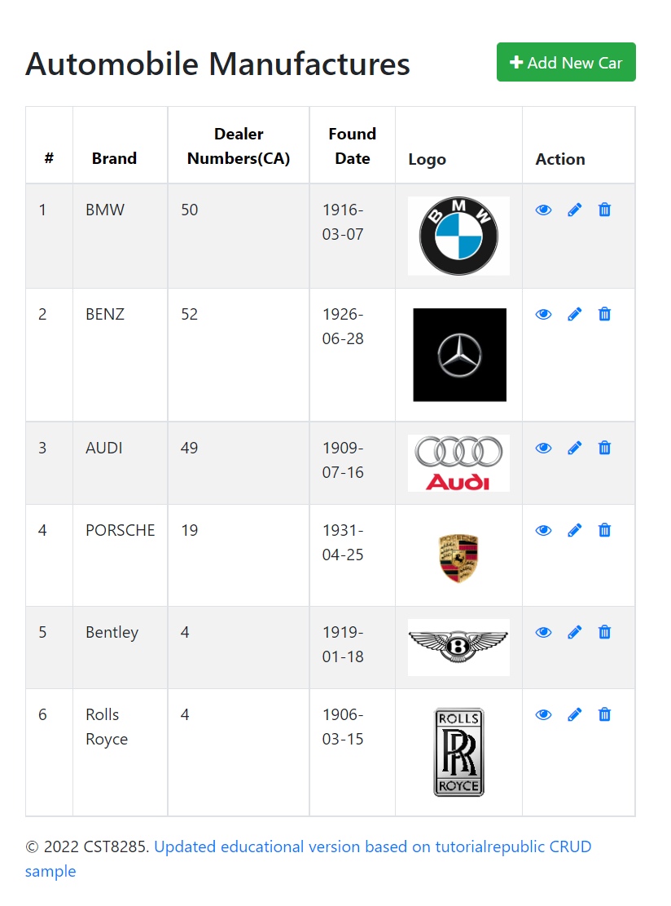

# WebApplication
## _Automobile Manufacturers Infomation Management System_

## Features
-	Created a well-designed website about automobile manufacturers information using HTML, CSS, and JavaScript.
-	Use PHP creating classes and functions to update and validate existing data and add new data.
-   Use Javascript for sorting based on id, brand name, dealer numbers, and found date separately
-	Use and execution of SQL queries to provide database access and management (MySQL) within a programming (PHP) environment. 
-	Created and troubleshoot database connections using PHP, accept user data, and save it to a database, recall data from a database and display it to the user. 

## Tech
- [x] HTML
- [x] PHP
- [x] CSS
- [x] JAVASCRIPT
- [x] MARKDOWN

## Images examples
### _Main page_

### _View page_

### _Insert page_

### _update page_

### _delete page_

---
- author: Jiayu Li (<li000448@algonquinlive.com>)
- date: 2022-04
...